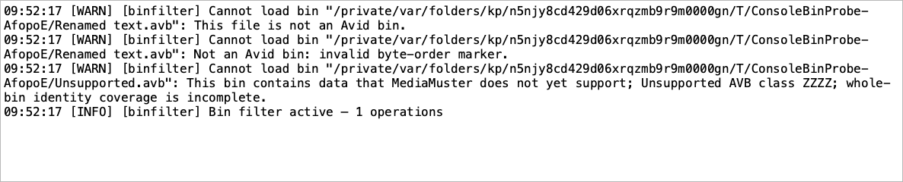

# Bin error examples

Rejected bins do not remain as red error rows or open an error message box. MediaMuster reports each rejected input or unsuccessful load in its console, including the filename, full path and reason. The existing console logger also records the warning in the diagnostic log. If the console is hidden, enable **View → Show Console** to read it.

## Which files can enter the list?

The + picker filters by `.avb` extension and sends selected bins directly to the background parser after Open. It does not perform a separate content check first. The parser validates the document header and the rest of the supported contents.

Drag and drop keeps a quick check of the extension and 21-byte Avid header signature, recognizing both supported byte orders. This allows an obvious impostor to be rejected before a drop is accepted. Passing this check does not guarantee a successful full read.

| Input | Drag and drop | + picker |
| --- | --- | --- |
| File without an `.avb` extension | Rejected; no row; console warning | Hidden by the picker filter; rejected with a console warning if submitted |
| Text, media or other non-AVB content renamed `.avb` | Rejected; no row; console warning | Loading row, then removed; console warning |
| Missing or unreadable `.avb` file | Rejected by the header check; console warning | If submitted or changed after selection: loading row, then removed; console warning |
| File with an Avid header but damaged contents | Loading row, then removed; console warning | Loading row, then removed; console warning |
| Bin with unsupported identity-bearing data | Loading row, then removed; console warning | Loading row, then removed; console warning |
| Valid bin with no media references | Retained as a usable empty bin | Retained as a usable empty bin |

A rejected drag logs its warning when it enters the drop area, even if the mouse button is never released there. Each distinct local path is checked once per entry; moving the pointer within the area does not repeat checks or warnings. Leaving and re-entering starts a new check and can log another warning. A mixed drop accepts recognized bins while rejected files are reported in the console. Truncation, malformed references and unsupported structures can be discovered later during the full read; a file replaced after the header check is also subject to full validation.

## What the console explains

Each failed file produces its own warning with the file path and diagnostic; errors are not held until the whole batch completes. Incomplete reads also include the parser's warnings explaining the unsupported data. These are examples of diagnostic content, rather than complete console lines. Byte offsets, reference numbers and operating-system messages vary with the actual file, and the drag header check can report a different reason from the full parser.

For example, the message text for a rejected drag, a damaged bin and an unsupported bin can look like this. The console adds its normal timestamp, warning level and `binfilter` module prefix:

```text
Cannot load bin "/Projects/Example/Renamed text.avb": This file is not an Avid bin.
Cannot load bin "/Projects/Example/Camera rushes.avb": Invalid AVB chunk length (byte 267)
Cannot load bin "/Projects/Example/Newer bin format.avb": This bin contains data that MediaMuster does not yet support; Unsupported AVB class ZZZZ; whole-bin identity coverage is incomplete.
```

| Situation | What it means | Example technical detail |
| --- | --- | --- |
| Wrong extension | The input is not an accepted bin filename | `Choose an Avid bin file with an .avb extension.` |
| Missing file | The file could not be opened | Drag: `This bin file no longer exists.`; background read: `AVB path is not a regular file.` |
| Permission denied | The file could not be opened | `Permission denied` |
| Non-AVB content renamed `.avb` | The file is not an Avid bin | Drag: `This file is not an Avid bin.`; background read: `Not an Avid bin: invalid byte-order marker.` or a size/header diagnostic |
| Truncated file with an Avid header | The bin could not be read | `Invalid AVB chunk length (byte 267)` |
| Broken reference | The bin could not be read | `Invalid AVB object reference 7 (byte 336)` |
| Invalid name encoding | The bin could not be read | `Invalid UTF-8 AVB string (byte 468)` |
| Over 256 MiB limit | The bin could not be read | `AVB file is empty, truncated, or exceeds the 256 MiB limit.` |
| Unsupported object type | Some media references could not be read | `Unsupported AVB class ZZZZ; whole-bin identity coverage is incomplete.` |
| Unsupported object version | Some media references could not be read | `Object 3 (SEQU): Unsupported AVB object version 127 (expected 3) (byte 427)` |
| Bin changes while being read | The bin could not be read | `AVB file changed while reading; load it again.` |
| Retained identity/metadata exceeds the application budget | The bin could not be read | `AVB identity and metadata inventory exceeds the 192 MiB memory budget.` |
| Invalid object counts, tags, root or lengths | The bin could not be read | `Invalid AVB object count or root reference` or `Truncated AVB property`, with a byte offset |
| Reference points to the wrong object kind | The bin could not be read | `AVB reference 3 must identify MCBR`, with a byte offset |
| Unsupported property extension | Some media references could not be read | `Unsupported AVB extension 0x7f`, with object and byte context |
| Unsupported bin version, track flags, attribute type or AudioSuite structure | Some media references could not be read | `Unsupported AVB bin version`, `Unsupported AVB track flags`, `Unsupported AVB attribute type 5`, or `Unsupported AudioSuite plug-in count`, with object and byte context |

Only valid, complete bins contribute filter operands or metadata. A valid empty bin displays “No media references.” in normal text and remains usable: Intersect with it matches zero rows. Removing a loading bin cancels its work and removes the row without a console failure warning; late results for that removed row are ignored. Loading failures alone do not reactivate a cleared filter.

## Current validation

All four affected test targets pass: 98 parser cases, 34 bin-dialog cases, 24 proxy cases and eight metadata cases (164 total), with no failures or skips. The universal macOS app rebuilt and passed strict bundle signature verification outside the sandbox.

An additional check of the actual main window and application Open dialog passed all 20 checks using temporary fixtures and the offscreen platform. It verified rejected-drag console output, selecting renamed text through Open, removing its failed loading row, accepting a valid empty uppercase `.AVB`, reporting unsupported data, and creating no error message boxes. This checks application event handling and the file-picker code path; it does not exercise Finder's drag animation or the native macOS file panel.



The two warnings for `Renamed text.avb` show separate attempts: first dragging, then selecting it through Open. [Validation results](evidence/avb-implementation-2026-09-06/console-validation.json) and [main-window checks](evidence/avb-implementation-2026-09-06/console-mainwindow-results.json) record the current revision.

## Historical validation

Before the console-only revision, all four affected test targets passed: 98 parser cases, 31 bin-dialog cases, 24 proxy cases and eight metadata cases, with no failures or skips. The universal macOS application rebuilt and passed strict bundle signature verification. The then-current single-file, grouped-failure and expanded-details dialogs were rendered and visually checked. These counts and screenshots describe the earlier message-box design.

## Historical screenshots

The [red error row examples](evidence/avb-implementation-2026-09-06/bin-error-states.png) and [full dialog screenshot](evidence/avb-implementation-2026-09-06/bin-error-dialog.png) show the earlier retained-error-row design.

The [single rejected file](evidence/avb-implementation-2026-09-06/error-dialog-single.png), [grouped rejected files](evidence/avb-implementation-2026-09-06/error-dialog-batch.png) and [expanded Show Details](evidence/avb-implementation-2026-09-06/error-dialog-batch-details.png) screenshots show the subsequent message-box design. They were rendered from actual widgets with deliberately constructed inputs.

All of these screenshots are preserved as historical evidence and do not show the current console-only reporting.
