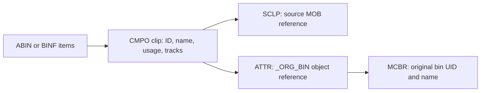

# AVB parser and Bin Filter review

Reviewed 5 September 2026 against MediaMuster commit `2342d07478166981c16d9860a2f19efdd565878d`, the supplied reference reader, the installed Media Composer 26.8.0.58987, and local AVB specimens. This is a review and evidence package; production code and tests have not been changed by this review. Claims and instructions in source comments and attached material were treated as material to verify.

The principal recommendation is a bounded, read-only AVB object reader, accompanied by corrections to the Bin Filter's row matching. A full timeline editor or AVB writer is unnecessary for the initial improvement. The current text scavenger is a compatibility heuristic whose success does not establish complete bin coverage.

## Confirmed findings

### 1. Read binary MOB properties, including file and render references — P1

Location: `src/avbparser.cpp:149–196`, with extraction at `:200–275`.

The parser reads ASCII MOB-looking text and one raw legacy wrapper. It never decodes the ordinary, tagged binary MOB property used by `CMPO` compositions and `SCLP` source clips. The attached AVB fixtures contain actual IDs that are absent from the text pass. One significant example is the precompute MasterMob named `Temp Title Demo 2012.01` in `tests/test_files/test_file_01.avb`; source-file identities are also missed. A matching master ID can mask a missing file ID in some media rows, so identity counts must not be presented as counts of lost media files.

Disassembly of the installed Avid reader shows the binary property being read field by field: `Read_AAFMobID` at `0x235bf0` in the arm64 `libameLibrary.dylib` reads a 12-byte label, four individual bytes, a 32-bit field, two 16-bit fields, and an 8-byte array. `ASourceClip::Get` calls the MOB readers. This is a known representation that can be decoded; the failure of a blind 32-byte scan does not invalidate binary parsing.

Implement object-boundary and property-aware reads of `CMPO` identity and `SCLP` references. Preserve where each identity came from and whether the relevant graph was understood. Do not accept any matching pattern in an arbitrary payload as conclusive membership, and exclude terminal-source null IDs, including legacy wrappers with a zero core.

The converse problem also exists: a generated bin containing an unrelated MOB-looking value in a normal comment attribute causes the scavenger to accept that value. Five ID/bin pairs found as text in the real sample had no corresponding decoded non-null MOB property; at least one came from `NewlyArrivedMobList`. That observation alone does not prove those five IDs are irrelevant external references. The ordinary-comment fixture does establish that the current method cannot distinguish identity from text.

### 2. Apply Intersect and Subtract to media-row matches — P1

Locations: `src/binfilterdialog.cpp:669–682`; `src/mediafilterproxy.cpp:271–277`.

The dialog intersects/subtracts sets of IDs. The proxy subsequently accepts a row when either its file MOB or master MOB is in the resulting set. Those operations are not equivalent to intersecting/subtracting matching rows.

An isolated C++ probe uses a row with file identity `F` and master identity `M`:

| Operations | Required row result | Current row result |
| --- | --- | --- |
| Intersect bin containing `M`, then Intersect bin containing `F` | Keep: the row matches both bins | Hidden: the ID intersection is empty |
| Intersect bin containing `M,F`, then Subtract bin containing `F` | Remove: the row matches the subtracted bin | Kept: `M` survives subtraction |

The probe links the current parser, dialog, table model and proxy, invokes the actual dialog operations, and counts the actual proxy rows. Its small ID fixtures isolate consumer behavior; they are not examples of structurally valid AVB files.

Retain the ordered operations in the filter and evaluate each bin's match against the row's identities, or resolve each bin into a set of stable media-row identities before combining sets. Define the starting universe explicitly. Merely adding more MOB IDs to the existing parser does not repair this defect.

### 3. Separate invalid, incomplete and genuinely empty bins — P1

Locations: `src/avbparser.cpp:128–148,276–277`; `src/binfilterdialog.cpp:400–409,579–585`.

A 12-byte `DomainDJBO` prefix with no document header or object data is returned as `valid=true`. No declared object count, root reference, chunk size, object reference or end-of-read status establishes that this is a usable bin. The result is loaded into the dialog.

Both that truncated input and a structurally valid empty bin produced the same consumer result: one loaded bin, zero IDs, no filter-change signal, filtering inactive, and the probe's unrelated media row still visible. Manual Intersect also did nothing. `mobs.isEmpty()` is incorrectly used as a proxy for “no bins selected.”

A valid empty-bin Intersect should create an active filter matching zero rows. An invalid or unsupported bin should display a useful failure/partial-coverage explanation and should not silently assert that nothing is referenced. Introduce explicit parse/coverage status and diagnostics; validate the complete document header and bounded object stream; gate operations on selected-bin count and parse status, not the number of discovered IDs.

### 4. A surviving chain changes when a loaded bin is removed — P2

Locations: `src/binfilterdialog.cpp:508–511,646–662`.

After removing the first Intersect step, a Subtract step can become first. Its starting set then comes from the current `allLoadedMobs()`. Removing a loaded bin changes the filter's result even though the surviving chain is unchanged. The consumer probe observed one visible row become zero. This contradicts the comment that chain steps snapshot their identities and deleting a loaded bin cannot invalidate them.

Use a stable, explicit starting universe, reject/rewrite a leading Subtract after chain edits, or evaluate the chain against the current media-row universe with that behavior clearly defined. Address this alongside finding 2.

## Recover clip and original-bin metadata through ownership

The parser's TODO identifies a worthwhile feature, but the current filename is not the original bin name. The exact relationship is already available:

The 14 attached fixtures plus the two repository OMF bins contain 80 `CMPO` owners with a readable `_ORG_BIN` → `MCBR` relationship. In `test_file_01.avb`, 52 such clips record `Demo` as the original bin name. The two repository OMF master clips also carry their original-bin references. See the metadata evidence script and results.

`src/mediafile.h:72` defines `originalBin` as the import-time `_ORG_BIN`. Fill that field from the owning clip's recorded `MCBR`, not `QFileInfo::completeBaseName()`. Current bin membership can be a separate, potentially multiple-valued property. Preserve `MCBR` UID as well as its name, prefer its UTF-8 name when present, and retain provenance when the same MOB occurs in several bins with different edited names. A current AVB clip name is useful metadata but should not silently override the existing MXF/MDB name precedence without a deliberate product rule.

`_ORG_BIN` is an object-valued attribute in these fixtures, not a plain text field.

## Correct the comments

| Current statement | Evidence-based replacement |
| --- | --- |
| `avbparser.cpp:16`: no index and no random access | The flat stream has ordinal object references. Build an offset/size table in one bounded pass and seek to objects on demand. Avid's object reader resolves references through an object table. Distinguish an on-disk index from an in-memory index. |
| `:27,149`: Avid writes a MOB into a bin as ASCII | Some attributes contain textual copies. Authoritative object properties also use typed binary serialization. State precisely what the current extractor reads and misses. |
| `:151`: tags occur every second byte | This describes only the four length/instance bytes. The ordinary binary value has byte-array framing, four tagged bytes, and a tagged UUID. The observed tagged representation is 49 bytes. |
| `:137`: header checks out, so this is a real bin | The 12-byte prefix is only a signature check; it does not establish structural validity or complete coverage. |
| `:33–35,119–125`: AVB is little endian; the header is the only endian-sensitive point | Both endian formats exist. Typed scalars follow the file's byte order; conversion to the application's chosen identity representation belongs at a defined boundary. The present raw/text heuristic stores both forms, masking distinctions rather than proving a universal layout. |
| `:176–189`: the size of a full reader/writer establishes the cost of useful parsing | The first useful subset is substantially narrower: object framing, root membership, component/track prefixes, MOB fields, attributes and bin references. Full timeline evaluation is a separate scope. |
| `:252–254`: exact wrapper means unrelated bytes can never mint an ID | A byte pattern alone cannot prove property ownership. Keep legacy evidence but qualify the guarantee; user text or opaque data can contain a complete valid-looking value. |
| `:190–196,248–250`: OMF file IDs are raw bytes, never text | The two fixture hits are observations about those files. Avid's `Read_OMFMobID` also reads legacy scalar words and reconstructs a wrapped ID; distinguish an observed contiguous copy from the general serialization contract. |
| `tst_avbparser.cpp:1–5`: all-zero, binary and truncation coverage | Most cases exercise header-plus-text scaffolds. The OMF cases are real bins, but the suite does not establish normal binary-MOB decoding or structural validation. Update the introduction and remove unused stale helpers. |

Keep historical measurements such as “117 bins / 1,556 joins” as dated observations with a corpus manifest, source hashes and replay script. This review does not reproduce that historical population. Such observations cannot justify an invariant about all bins or future writers. The old comment's warning against blind 32-byte slicing remains valid.

## Implementation order and acceptance criteria

1. Repair empty-bin handling and per-row filter algebra, including chain edits. These changes can be verified independently of a parser rewrite.
2. Add a bounded, endian-aware document reader: full header, declared object count and root, checked class/length records and object references. Index offsets without reading the entire file into memory. Check arithmetic before allocation or seeking, cap object/reference counts and cumulative work, and report a concurrent short read or malformed chunk.
3. Decode the minimum object/property subset for `ABIN`/`BINF`, `CMPO`, `SCLP`, shared component/track prefixes, `ATTR`, and `MCBR`. Account for observed bin item count versions `0x0e`/`0x0f`. Retain unknown chunks by size, but report incomplete coverage if an unsupported class/property affects the selected graph; skipping a chunk is not proof that its dependencies are irrelevant.
4. Add explicit identity normalization and provenance. Preserve established legacy OMF joins. Any temporary heuristic recovery should be marked as such rather than silently merged into authoritative results.
5. Use the graph for clip-name/original-bin enrichment and, later, sequence-specific dependency filtering. Whole-bin identity membership does not prove that a clip is used in a particular sequence; effects, precomputes, groups, selectors and other graph edges require explicit coverage before promising that feature.
6. Move bin reading off the GUI thread with cancellation and bounded work once real graph parsing is introduced. Loading several large bins currently performs synchronous `readAll()` and scanning in the dialog call path.

Tests should include genuine little- and big-endian objects; a master present only in binary; an ordinary string containing an unrelated valid-looking MOB; empty valid bins; header-only/truncated/chunk-overflow/bad-reference bins; null source references; legacy OMF joins; unknown dependency classes; large-bin count framing; and the consumer cases above. Compare identities by semantic role and normalized value, not by the current implementation's doubled alias count.

The reference reader is not an infallible validator: it uses assertions and has strict unknown-tag handling. Cross-check critical decisions against Avid binary behavior and independent fixtures. This review uses the supplied revision for reproducibility.

## Verification and evidence

The differential comparison covered 42 files: 14 attached bins, two repository OMF bins, and 26 AVBs under the local Avid Projects directory. There are 40 distinct file hashes; the two repository OMF fixtures duplicate two local specimens. The actual current C++ parser agreed with the independently scripted reproduction of its behavior on all 42. A prototype 49-byte tagged-value decoder, confined to indexed chunks, agreed with the reference reader's decoded non-null IDs on all 42. This validates the format experiment on that sample; the prototype is still a pattern search inside chunks, not a production property/ownership reader. Five `CDCI` descriptor objects in one local bin rejected an extension tag (`0x11`) in the reference reader; they were recorded and skipped by index. The identity-owning objects parsed, so agreement on IDs does not imply complete parsing of every object.

There were 1,622 distinct non-null ID/bin pairs, of which the existing extractor missed 1,232. These are per-bin identity observations, including physical source identities, not 1,232 missing media files. The missing properties include 16 precompute MasterMob/bin pairs (one in the attached sample and 15 in the local project bins) and 15 local rendered-file MOB/bin pairs. Null legacy wrappers were excluded from these figures.

As a separate check, the structured file/master IDs were joined to an existing 2,493-row media-export audit. All 363 matched bin/media pairs were also matched by the old extractor through an available identity; this comparison found **zero missed media rows**. It does not cover media absent from that export, and was not a fresh rescan of all media. Minimal generated little- and big-endian bins with a binary-only master provide the direct counterexample to complete extraction: they reopen structurally in the reference reader but yield no IDs in MediaMuster. They have not been opened and resaved in Media Composer. These distinctions keep the compatibility recommendation separate from unsupported claims about measured media loss.

The existing `tst_avbparser` target was rebuilt and its CTest entry passed. The direct test report shows 9 passes including setup/cleanup, 0 failures. That success establishes the old tests still pass; the independent probes above expose behavior those tests do not cover.

The local working evidence is under `/tmp/mediamuster-avb-review/`: `corpus/` contains the current-C++ parser probe and reference-reader comparison; `consumer-probe/` contains the compiled dialog/proxy scenarios; `metadata/` contains the original-bin ownership inventory; `binary/` contains hashes and focused disassembly. Binary addresses refer to the inspected arm64 slice, not process addresses or offsets valid for all Media Composer versions. No Media Composer code was patched or installed.

Focused decompilation succeeded for the Avid object/stream and MOB reader functions, including `AObjDoc::ReadCB` and `Read_AAFMobID`. Assembly remains the reference for interpreting decompiler output. The generic object infrastructure contains reference-width variants; that does not establish that all such variants occur in the sampled AVB files.

The [durable evidence package](evidence/avb-review-2026-09-05/README.md) includes compact results, source fingerprints, replay scripts, small generated fixtures, and the [binary findings](evidence/avb-review-2026-09-05/binary/evidence.md). Large intermediate outputs and raw pseudocode remain in the scratch location above.
